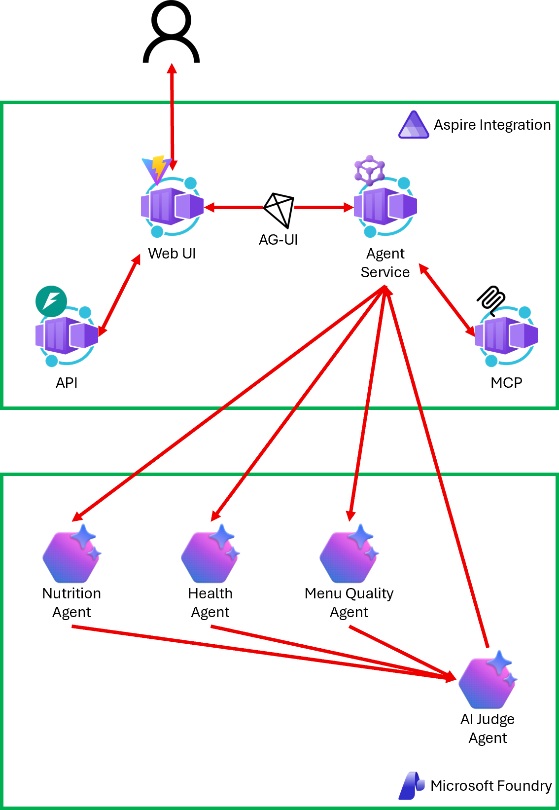

# 전국 초중고 급식 정보 조회 및 분석 앱

NEIS 오픈 API를 기반으로 전국 초중고의 중식을 조회하고, Microsoft Agent
Framework의 전문 에이전트들이 두 학교의 식단을 비교 분석하는 풀스택
애플리케이션입니다. Aspire가 Web, API, MCP, Agent 서비스와 Microsoft Foundry
리소스를 함께 오케스트레이션합니다.

## 아키텍처



- Web은 `/api/*`로 급식 조회 API를 호출하고 `/agent`로 AG-UI SSE 분석 결과를
  받습니다.
- Agent 서비스는 MCP의 `getSchoolInfo`, `getMealServiceDietInfo` 도구로 데이터를
  준비한 뒤 Nutrition, Health, Menu Quality Agent를 병렬 실행합니다.
- AI Judge는 전문 에이전트의 점수를 바꾸지 않고 근거, 일관성, 개선안과 한계를
  종합합니다.
- Azure에서는 Web만 외부에 공개하고 API, MCP, Agent는 Container Apps 내부
  endpoint로 유지합니다.

```text
school-lunch/
├── apphost.mts          Aspire AppHost와 Azure 배포 모델
├── assets/              문서 이미지
├── scripts/             테스트·배포 보조 스크립트
├── src/
│   ├── api/             FastAPI 급식 조회 API
│   ├── web/             React + Vite Web UI
│   ├── mcp/             OpenAPI 기반 MCP 서버
│   ├── agent/           AG-UI 멀티에이전트 분석 서비스
│   ├── e2e/             Playwright E2E 테스트
│   └── openapi.json     NEIS API 단일 명세 원본
├── AGENTS.md            AI 코딩 에이전트 지침
├── PRD.md               제품 요구사항
└── TRD.md               기술 요구사항
```

## 사전 준비물

| 도구 | 버전 / 용도 |
| --- | --- |
| Python | 3.12+ |
| [uv](https://docs.astral.sh/uv/) | Python 의존성 관리 |
| Node.js | 20.19+ 또는 22.13+ (24 LTS 권장) |
| npm | 10+ |
| [Aspire CLI](https://aspire.dev/get-started/install-cli/) | 13.4+ |
| [Azure CLI](https://learn.microsoft.com/cli/azure/install-azure-cli) | Foundry 인증과 Azure 배포 |
| Docker | 24+; Azure 배포 이미지 빌드 |
| NEIS API 키 | [교육정보 개방 포털](https://open.neis.go.kr/)에서 발급 |

## 시작하기

### 1. 환경 변수 설정

저장소 루트에 gitignored `.env`를 만들고 `NEIS_API_KEY`를 실제 값으로
바꿉니다. Aspire는 Foundry project와 model deployment를 직접 프로비저닝하므로
로컬 Aspire 실행에는 Foundry endpoint 변수가 필요하지 않습니다.

PowerShell:

```powershell
Copy-Item .env.example .env
notepad .env
```

Bash:

```bash
cp .env.example .env
${EDITOR:-vi} .env
```

`.env`에는 최소한 다음 값이 있어야 합니다.

```dotenv
NEIS_API_KEY=발급받은_NEIS_API_키
```

`.env`를 커밋하거나 키를 명령 기록·로그에 출력하지 마세요.

### 2. Aspire로 로컬 실행

```bash
npm install
az login
npm run dev
```

Aspire 대시보드에서 `api`, `mcp`, `agent`, `web`과 Foundry 리소스의 상태, 로그,
트레이스, 실행 URL을 확인할 수 있습니다. Web의 endpoint를 열어 앱을 사용합니다.
종료하려면 실행 터미널에서 `Ctrl+C`를 누르거나 다른 터미널에서 다음을 실행합니다.

```bash
aspire stop
```

## Azure로 배포

`apphost.mts`가 Azure Container Apps와 Foundry 배포 토폴로지의 단일 원본입니다.
먼저 Azure에 로그인하고 배포 대상 값을 현재 셸에 설정합니다.

PowerShell:

```powershell
az login
$env:Azure__SubscriptionId = az account show --query id -o tsv
$env:Azure__Location = "koreacentral"
$env:Azure__ResourceGroup = "rg-school-lunch"
aspire deploy --environment production --non-interactive
```

Bash:

```bash
az login
export Azure__SubscriptionId="$(az account show --query id -o tsv)"
export Azure__Location="koreacentral"
export Azure__ResourceGroup="rg-school-lunch"
aspire deploy --environment production --non-interactive
```

배포 전에 실행 단계를 검토하려면
`aspire deploy --list-steps --non-interactive`를 사용합니다. CI에서는
`Parameters__neis_api_key`를 저장소 secret으로 주입하며, 로컬 배포는 앞서 만든
`.env`의 `NEIS_API_KEY`를 사용합니다.

배포 리소스를 제거하려면 다음을 실행합니다.

```bash
aspire destroy --environment production
```

GitHub Actions OIDC와 배포 변수 구성은
[`src/README.md`](./src/README.md#github-actions-배포-구성)를 참고하세요.

## 테스트

아래 스크립트는 잠긴 의존성을 설치하고 AppHost, API, MCP, Agent, Web, E2E 검증을
순서대로 모두 실행합니다. 실제 NEIS나 Foundry에는 연결하지 않습니다.

PowerShell:

```powershell
./scripts/test-all.ps1
```

Bash:

```bash
./scripts/test-all.sh
```

## 트러블슈팅

- **Aspire가 `NEIS_API_KEY`를 요청함** — 루트 `.env`에 키가 있고 변수 이름이
  정확한지 확인합니다.
- **Foundry 인증 실패** — `az login` 후 현재 계정이 대상 subscription과 Foundry
  리소스를 사용할 권한이 있는지 확인합니다.
- **Docker를 찾을 수 없음** — Azure 배포 전 Docker Desktop 또는 Docker daemon이
  실행 중인지 확인합니다.
- **E2E에서 Chromium을 실행할 수 없음** — `cd src/e2e` 후
  `npx playwright install --with-deps chromium`을 실행합니다.
- **포트 또는 orphaned Aspire 프로세스 충돌** — `aspire stop`으로 기존 AppHost를
  중지한 뒤 다시 실행합니다.

## 더 자세히 보기

- [전체 개발·실행·배포 가이드](./src/README.md)
- [API README](./src/api/README.md)
- [Web README](./src/web/README.md)
- [MCP README](./src/mcp/README.md)
- [Agent README](./src/agent/README.md)
- [E2E README](./src/e2e/README.md)
- [제품 요구사항](./PRD.md)
- [기술 요구사항](./TRD.md)
- [급식 비교 평가 기준](./EVALUATION-RUBRIC.md)
